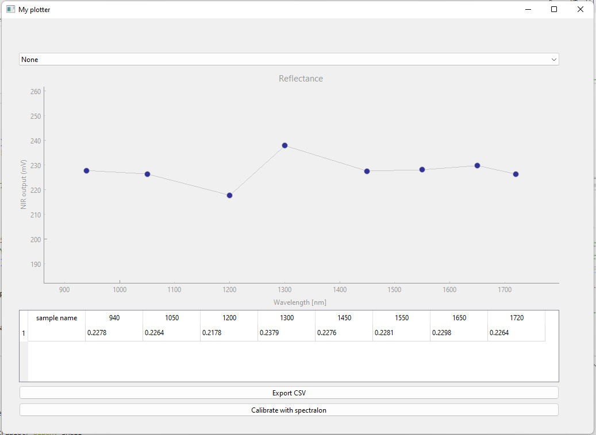

# PSplot

*A lightweight tool for obtaining and visualising the discrete near-infrared (NIR) data using the Plastic Scanner.*




> WARNING: still in early development, not a stable release! See GitHub [issues](https://github.com/Plastic-Scanner/PSplot/issues)


## Installation

Requires python >=3.8, pipenv
Install python dependencies (listed in Pipfile):
```
$ pipenv install
```

Start the shell and run the program:
```
$ pipenv shell
$ python psplot.py
```
Use `exit` or Ctrl+D to exit pipenv shell


## Usage

Select the serial device from the dropdown menu on the top (e.g. /dev/ttyACM0 or COM5). Dummy data will be used when no device connected.  
Use spacebar to get a measurement (plot needs to be focused/clicked first, see [bug](https://github.com/Plastic-Scanner/PSplot/issues/12)).
Using the "calibrate" button it performs a measurement, taken as a reference - displaying measurements between 0 and 1.


## Contributing

Feel free to improve, modify and contribute to this project. It's part of the [Plastic Scanner](plasticscanner.com) open source hardware development, check out the [docs](docs.plasticscanner.com) as well!

